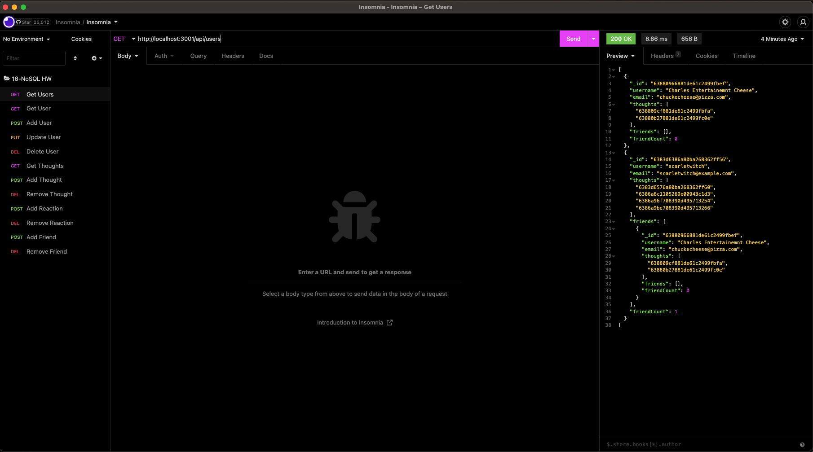

 # <u>Social Network Api</u>

  
  
  

  ## <u>Table of Contents:</u>
  ### [License](#license)
  ### * [Description](#description)
  ### * [Installation](#install)
  ### * [Usage](#usage)
  ### * [Contributors](#contributors)
  ### * [Testing](#testing)
  ### * [Questions](#questions)

  ## License
  ### MIT

  ## <u>Description</u>
  ### This is the backend of  socail media app, demonstrating CRUD methods for users and posts. 

## Built With: 
- JavaScript
- Insomnia
- MongoDB
- Mongoose

Link to demonstration video: 
https://drive.google.com/file/d/1nOB8dxyq_Jc-J3lTn9ISjIJWPZIwi2W1/view
  ## <u>Installation:</u>
  ### Please follow these steps to install:
  ### No installation needed, just start the server locally by running 'npm run start'

  ## <u>Usage:</u>
  ### After starting the server, go to your favorite app to test APIs, I used Insomnia. From there you can test out the various CRUD methods for users and posts. 

  ## <u>Contributors:</u> 
  ### Alex Defrese

  ## <u>Testing:</u>
  ### Please follow these steps to test the project:
  ### See above for how to use.

  ## <u>Questions:</u> 
  ### If you have any questions or suggestions, please contact me through either
  ### GitHub: https://github.com/AlexDefrese
  ### or
  ### Email: aidandefrese@gmail.com

